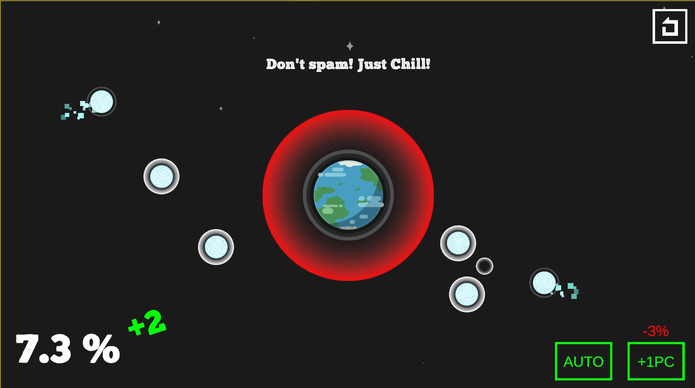
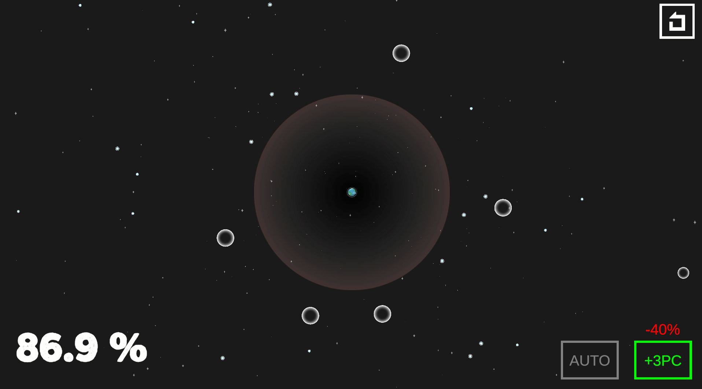

# BigBangBubbleGGJ2025

This game was made for the Global Game Jam 2025. In Big Bang Bubble, you control a growing planet surrounded by a protective bubble. Your goal is to expand the bubble by clicking on the screen while avoiding meteors that can shrink your bubble.

### ----------------- CONTROLS -----------------

Left Mouse Click: Increases the bubble size around the planet.

Right Mouse Click: Shoots smaller defensive bubbles to stop meteors. 

### ----------------- GAME PLAY -----------------

Video Gameplay:

Screenshot:

### --------------- EXTERNAL ASSETS ---------------

Music by AudioCoffee

Cartoon FX Remaster Free by Jean Moreno

Planet image by DinV Studio  

### --------------- EXTERNAL LINKS ---------------

Game Jam Page: [Big Bang Bubble | Global Game Jam](https://globalgamejam.org/games/2025/big-bang-bubble-3)

Game Website : [Big Bang Bubble | Itch.io](https://loveplatform.itch.io/big-bang-bubble)
